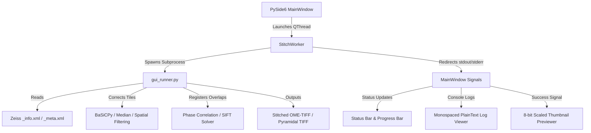

<div align="center">

# AXIO Stitching Studio

[](https://opensource.org/licenses/MIT)
[](https://www.python.org/downloads/)
[](https://wiki.qt.io/Qt_for_Python)

**High-throughput spatial microscopy stitching pipeline for Zeiss Axio Tile Scans.**

</div>

---

## 🔬 Overview

The **AXIO Stitching Studio** is a standalone desktop application wrapping a heavy scientific stitching pipeline into a native, responsive interface using PySide6. It is designed to handle massive high-resolution spatial microscopy datasets, incorporating flatfield shading corrections and robust global stitching algorithms to assemble large-scale, multi-tile tissue images (up to 5,000+ tiles per scene) into single contiguous mosaics.

## 🏗️ Architecture

To ensure memory-heavy calculations (e.g., PyTorch-dct, BaSiCPy flatfield corrections, least-squares optimization) do not freeze the main UI, the application executes the core stitching engine via a decoupled subprocess environment.



## ✨ Features

- **Decoupled Execution**: UI remains responsive during intense CPU/GPU computation.
- **Multiple Shading Corrections**: Choose between BaSiCPy, median, or spatial filters.
- **Advanced Registration Options**: Feature-based (SIFT with Tikhonov-anchored least-squares) or Frequency-based (Phase Correlation).
- **Multi-Channel & Split-Channel Stitching**: Automatically align fluorescent channels based on a reference channel.
- **3D Z-Stack Support**: Stitch volumetric data with MIP or Reference-Slice alignment.

## 📥 Quick Start (No Python Required)

For Windows users, one installer sets up everything — the desktop GUI, the `axio` CLI, the
MCP server, and (optionally, checked by default) the AI-agent integration for every platform
detected on your machine (Claude Code, ChatGPT/Codex, Google Antigravity, Claude Desktop,
Gemini CLI):

1. Go to the [Releases](https://github.com/phwr9jj7-beep/AXIO_Sticthing/releases) page.
2. Download and run `AXIO_Stitching_Studio_<version>_Setup.exe` (per-user install, no admin).
3. Launch **AXIO Stitching Studio** from the Start menu. Restart any open agent apps once so
   they pick up the new MCP server.

Uninstalling cleanly deregisters the agent integration before removing files. To rebuild the
installer from source: `python scripts/build_installer.py` (needs PyInstaller + Inno Setup 6).

## 🛠️ Installation

```bash
git clone https://github.com/phwr9jj7-beep/AXIO_Sticthing.git
cd AXIO_Sticthing
conda env create -f environment.yml
conda activate axio_stitching
```

## 🚀 Usage

Simply launch the GUI using the provided scripts:

**Windows:**
```bash
launcher.bat
```

**Linux/macOS:**
```bash
bash launcher.sh
```
1. Drag and drop a Zeiss `_info.xml` metadata file.
2. Select your Shading Correction and Stitching Algorithm.
3. Configure multi-channel settings if necessary.
4. Click **Run Stitching Pipeline**.

### Command line

The same pipeline is available headlessly through the `axio` command (`pip install -e ".[all]"`):

```bash
axio doctor                                                   # diagnose the environment first
axio inspect  --xml "D:/data/scan_info.xml"                    # scenes, tiles, channels, Z
axio estimate --xml "D:/data/scan_info.xml" --out-dir "D:/out" # canvas, peak RAM, disk, time
axio validate --xml "D:/data/scan_info.xml" --out-dir "D:/out"
axio stitch   --xml "D:/data/scan_info.xml" --out-dir "D:/out" --correction basicpy --algorithm phase
axio qc       "D:/out/stitched_scene0_phase.tif"               # empty area, clipping, seams
```

`axio estimate` is worth the ten seconds it costs: these canvases are gigapixel, and it
reports whether the job fits in RAM and on disk *before* you spend an hour finding out.
Every command takes `--json` for scripting.

## 🤖 AI agent integration (MCP + Skill)

AXIO ships an **MCP server** (16 typed tools) and an **Agent Skill**, and an installer that
wires both into the agent platforms on your machine:

```bash
axio agent status              # what is detected, installed, or drifted
axio agent install --dry-run   # every file and config key that would change
axio agent install             # every platform detected on this machine
axio agent uninstall           # remove only what AXIO wrote, hash-verified
```

| Target | Covers |
|---|---|
| `claude-code` | Claude Code CLI **and** the Claude Code desktop app |
| `codex` | Codex CLI, the Codex IDE extension, and the **ChatGPT desktop app** |
| `antigravity` | Google Antigravity IDE |
| `claude-desktop` | The classic Claude Desktop app |
| `gemini-cli` | Gemini CLI |

Shared config files (Codex's `config.toml`, Antigravity's `mcp_config.json`, Claude Desktop's
`claude_desktop_config.json`) are edited **surgically**: one owned key, backed up before the
first change, written atomically, and removed on uninstall only while it still hashes to what
was written — anything you have since edited is reported as drift and left alone.

Long stitches run as background jobs (`axio_start_stitch` → `axio_job_status`), because a real
scene takes minutes to hours and a synchronous tool call would simply time out.

See **[docs/AGENT_INTEGRATION.md](docs/AGENT_INTEGRATION.md)** for the per-platform paths, the
full tool list, and the safety contract.

## 📖 Wiki & Documentation

Comprehensive architectural guidelines, testing specifications, and workflow protocols can be found in the [GitHub Wiki](https://github.com/phwr9jj7-beep/AXIO_Sticthing/wiki).

Have a question? Join the [Discussions Forum](https://github.com/phwr9jj7-beep/AXIO_Sticthing/discussions)!

## 📂 Data Availability

Due to the massive size of spatial microscopy scans, the raw datasets (15GB+) are not hosted in this GitHub repository. The raw 2026-04-17 `.tif` tile scans and corresponding metadata XMLs are permanently hosted and openly accessible at:
> *[Insert Zenodo / Figshare DOI Link Here]*

## 📚 References & Citations

If you use this software, please consider citing the underlying algorithms that power the pipeline:

1. **BaSiCPy Shading Correction**: 
   *Peng, T., Thorn, K., Schroeder, T. et al. A BaSiC tool for background and shading correction of optical microscopy images. Nat Commun 8, 14836 (2017). https://doi.org/10.1038/ncomms14836*
2. **SIFT Feature Extraction**: 
   *Lowe, D.G. Distinctive Image Features from Scale-Invariant Keypoints. International Journal of Computer Vision 60, 91–110 (2004). https://doi.org/10.1023/B:VISI.0000029664.99615.94*
