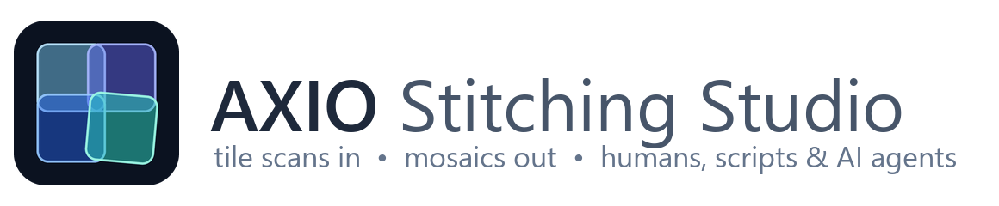
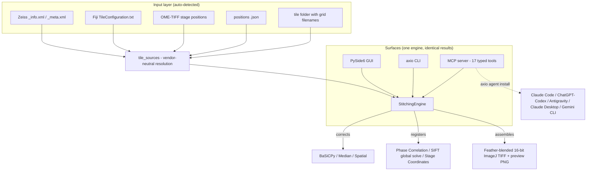

<div align="center">

<picture>
  <source media="(prefers-color-scheme: dark)" srcset="assets/logo-dark.png">
  
</picture>

[](https://opensource.org/licenses/BSD-3-Clause)
[](https://pypi.org/project/axio-stitching/)
[](https://www.python.org/downloads/)
[](https://wiki.qt.io/Qt_for_Python)
[](tests/)

**High-throughput microscopy tile-scan stitching — Zeiss and vendor-neutral — as a desktop app, a CLI, and an AI-agent tool server.**

</div>

---

## 🔬 Overview

AXIO Stitching Studio assembles massive tiled microscopy scans (up to 5,000+ tiles per
scene, gigapixel canvases) into contiguous mosaics, with flatfield shading correction and
globally-optimized tile registration. One engine drives three surfaces, so every route
produces identical results:

| Surface | For | Entry point |
|---|---|---|
| 🖥️ **Desktop GUI** | Interactive use, no programming | `AXIO_Stitching_Studio.exe` / `launcher.bat` |
| ⌨️ **`axio` CLI** | Scripting, pipelines, HPC | `axio stitch --source ... --out-dir ...` |
| 🤖 **MCP server + Agent Skill** | AI agents (Claude Code, ChatGPT/Codex, Google Antigravity, …) | `axio agent install` |

Originally built for Zeiss Axio tile scans, the input layer is now **vendor-neutral**: it
auto-detects Zeiss XML, Fiji/ImageJ `TileConfiguration.txt`, OME-TIFF stage positions, an
explicit positions list, or a bare folder of TIFFs with grid-encoded filenames.

## 🏗️ Architecture



Supporting subsystems the surfaces share: **doctor** (environment diagnosis with fixes),
**estimate** (pre-flight canvas/RAM/disk/time sizing with an `ok / tight / will_not_fit`
verdict), **jobs** (background execution with journalling and orphan detection), and
**qc** (memory-bounded mosaic metrics: empty area, clipping, seam prominence).

## ✨ Features

- **Vendor-neutral inputs** — Zeiss XML, Fiji TileConfiguration, OME-TIFF `PositionX/Y`,
  explicit positions, or filename-encoded grids, auto-detected with a confidence rating.
- **Pre-flight sizing** — `axio estimate` reports canvas dimensions, peak RAM, disk needs,
  and rough wall-clock *before* a run, so a gigapixel job never dies 40 minutes in.
- **Shading correction** — BaSiCPy flatfield, median profile, or spatial background
  subtraction.
- **Global registration** — bounded phase correlation or SIFT with a Tikhonov-anchored
  least-squares solve (a single bad tile pair cannot corrupt the mosaic), or pure stage
  coordinates.
- **Multi-channel & split-channel** — channels inside one TIFF (`ref_channel`) or one file
  per channel (`ref_tag`/`target_tags`); registration is computed once on the reference and
  applied to every channel, so they stay in register. Both layouts are **auto-recognized**,
  including the exact parameters to pass.
- **3D Z-stacks** — in-file or filename-tagged slices (auto-recognized); MIP-aligned or
  reference-slice-aligned volumes, or a cheap MIP-only projection.
- **Built-in QC** — streamed (memory-bounded) metrics over the finished mosaic plus a
  preview image, so "exit 0" is never mistaken for "stitched correctly".
- **Responsive GUI** — the engine runs in a decoupled subprocess; the UI never freezes, and
  when launched by an AI agent it opens pre-loaded with the agent's dataset, parameters, and
  finished preview.

## 📥 Quick Start (No Python Required)

For Windows users, one installer sets up everything — the desktop GUI, the `axio` CLI, the
MCP server, and (optionally, checked by default) the AI-agent integration for every platform
detected on your machine:

1. Go to the [Releases](https://github.com/phwr9jj7-beep/AXIO_Sticthing/releases) page.
2. Download and run `AXIO_Stitching_Studio_<version>_Setup.exe` (per-user install, no admin).
3. Launch **AXIO Stitching Studio** from the Start menu. Restart any open agent apps once so
   they pick up the new MCP server.

> **Windows SmartScreen note:** the installer is not code-signed, so on first run Windows
> may show *"Windows protected your PC"*. Click **More info → Run anyway** to proceed. To
> verify what you downloaded, compare the file's SHA-256
> (`Get-FileHash AXIO_Stitching_Studio_<version>_Setup.exe` in PowerShell) against the
> `SHA256SUMS.txt` attached to the same release — every release artifact is built from
> its git tag by the public [CI workflow](.github/workflows/release.yml), so its
> provenance is auditable.

Uninstalling cleanly deregisters the agent integration before removing files. To rebuild the
installer from source: `python scripts/build_installer.py` (needs PyInstaller + Inno Setup 6).

## 🛠️ Installation (Python, any platform)

The package is on **PyPI** — one line installs the `axio` CLI, the MCP server, and
(with the `[all]` extra) the GUI and BaSiCPy shading correction, on Windows, macOS,
Linux, or an HPC cluster with Python ≥ 3.10:

```bash
pip install "axio-stitching[all]"
```

Lighter footprints: `axio-stitching[mcp,metrics]` for an agent/headless install (no GUI),
or bare `axio-stitching` for the core engine and CLI only. After installing, run
`axio agent install` to wire it into your AI agents and `axio doctor` to check the
environment.

<details>
<summary>From source (conda or editable pip)</summary>

```bash
git clone https://github.com/phwr9jj7-beep/AXIO_Sticthing.git
cd AXIO_Sticthing
conda env create -f environment.yml   # creates axio-stitch-env with every dependency
conda activate axio-stitch-env
# …or, into an existing Python ≥ 3.10 environment:
pip install -e ".[all]"
```
</details>

## 🚀 Usage

### Desktop GUI

**Windows:** `launcher.bat` · **Linux/macOS:** `bash launcher.sh`

1. Drag and drop a Zeiss `_info.xml` metadata file (or use **Browse…**).
2. Select your Shading Correction and Stitching Algorithm.
3. Configure multi-channel / Z-stack settings if necessary.
4. Click **Run Stitching Pipeline** — the preview appears in the second tab when done.

### Command line

```bash
axio doctor                                                      # diagnose the environment first
axio inspect  --source "D:/data/scan_info.xml"                    # scenes, tiles, channels, Z
axio estimate --source "D:/data/scan_info.xml" --out-dir "D:/out" # canvas, peak RAM, disk, time
axio validate --source "D:/data/scan_info.xml" --out-dir "D:/out"
axio stitch   --source "D:/data/scan_info.xml" --out-dir "D:/out" --correction basicpy --algorithm phase
axio qc       "D:/out/stitched_scene0_phase.tif"                  # empty area, clipping, seams
axio outputs  "D:/out"                                            # what a previous run produced
```

`--source` accepts **any** supported input (`--xml` remains as a legacy alias):

| Input | Example | Positions from |
|---|---|---|
| Zeiss XML | `scan_info.xml` / `scan_meta.xml` | stage coordinates / meander grid |
| Fiji config | `TileConfiguration.txt` (or `.registered.txt`) | pixel positions in the file |
| OME-TIFF | a folder of `*.ome.tif` | embedded `Plane PositionX/Y` metadata |
| positions JSON | `{"tiles":[{"filename","x","y"}]}` | supplied explicitly |
| tile folder | filenames like `x00_y01`, `r0c1`, `Position012` | inferred grid + `--overlap` |

`axio estimate` is worth the ten seconds it costs: these canvases are gigapixel, and it
reports whether the job fits in RAM and on disk *before* you spend an hour finding out.
Every command takes `--json` for scripting.

## 🤖 AI agent integration (MCP + Skill)

AXIO ships an **MCP server** (17 typed tools) and an **Agent Skill**, and an installer that
wires both into the agent platforms on your machine:

```bash
axio agent status              # what is detected, installed, or drifted
axio agent install --dry-run   # every file and config key that would change
axio agent install             # every platform detected on this machine
axio agent uninstall           # remove only what AXIO wrote, hash-verified
```

| Target | Covers |
|---|---|
| `claude-code` | Claude Code CLI **and** the Claude Code desktop app |
| `codex` | Codex CLI, the Codex IDE extension, and the **ChatGPT desktop app** |
| `antigravity` | Google Antigravity IDE |
| `claude-desktop` | The classic Claude Desktop app |
| `gemini-cli` | Gemini CLI |

The tools cover the full loop an agent needs: environment diagnosis, dataset inspection
(with **automatic recognition of split-channel and Z-stack layouts**, down to the exact
parameters to pass), pre-flight sizing with an actionable verdict, background stitching with
job polling and cooperative cancellation, preview images the agent can actually look at,
streamed QC metrics, and a GUI handoff that opens the app **pre-loaded with the agent's
dataset, parameters, and finished preview**.

Shared config files (Codex's `config.toml`, Antigravity's `mcp_config.json`, Claude Desktop's
`claude_desktop_config.json`) are edited **surgically**: one owned key, backed up before the
first change, written atomically, and removed on uninstall only while it still hashes to what
was written — anything you have since edited is reported as drift and left alone.

See **[docs/AGENT_INTEGRATION.md](docs/AGENT_INTEGRATION.md)** for the per-platform paths,
the full tool list, and the safety contract.

## 🧪 Testing

```bash
pip install -e ".[dev]"
pytest            # 353 tests: engine, input formats, MCP tools, installer safety, QC, CLI
```

## 📖 Wiki & Documentation

- [docs/AGENT_INTEGRATION.md](docs/AGENT_INTEGRATION.md) — agent platforms, MCP tools, installer safety contract.
- [SPEC.md](SPEC.md) — technical specification and test plan.
- [CHANGELOG.md](CHANGELOG.md) — release history.
- Comprehensive architectural guidelines and workflow protocols in the [GitHub Wiki](https://github.com/phwr9jj7-beep/AXIO_Sticthing/wiki).
- Have a question? Join the [Discussions Forum](https://github.com/phwr9jj7-beep/AXIO_Sticthing/discussions)!

## 📂 Data Availability

Due to the massive size of spatial microscopy scans, the raw datasets (15GB+) are not hosted in this GitHub repository. The raw 2026-04-17 `.tif` tile scans and corresponding metadata XMLs are permanently hosted and openly accessible at:
> *[Insert Zenodo / Figshare DOI Link Here]*

## 📚 References & Citations

If you use this software, please consider citing the underlying algorithms that power the pipeline:

1. **BaSiCPy Shading Correction**: 
   *Peng, T., Thorn, K., Schroeder, T. et al. A BaSiC tool for background and shading correction of optical microscopy images. Nat Commun 8, 14836 (2017). https://doi.org/10.1038/ncomms14836*
2. **SIFT Feature Extraction**: 
   *Lowe, D.G. Distinctive Image Features from Scale-Invariant Keypoints. International Journal of Computer Vision 60, 91–110 (2004). https://doi.org/10.1023/B:VISI.0000029664.99615.94*

## 📄 License

AXIO Stitching Studio is released under the **BSD 3-Clause License** —
Copyright © 2026 BSGOU and OnoLab. You may use, modify, and redistribute it,
including commercially, provided the copyright notice and disclaimer are
retained and the copyright holders' names are not used to endorse derived
products without permission. See [LICENSE](LICENSE) for the full text.
