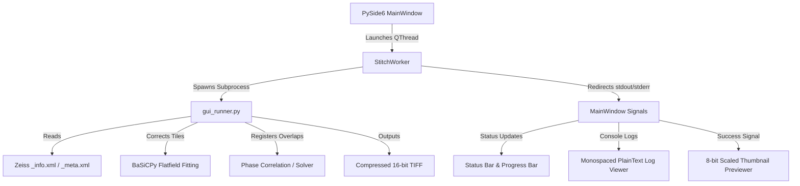

# AXIO Stitching Studio Technical Specification & Test Plan (SPEC.md)

This document contains the official architectural specification, API mappings, and a comprehensive validation test plan for the AXIO Stitching Studio standalone desktop application.

---

## 🏗️ 1. Architecture Overview

The stitching pipeline lives in the `axio_stitching` package (`StitchingEngine` plus the
vendor-neutral input layer `tile_sources`), and THREE surfaces drive that one engine so every
route produces identical results:

1. the **desktop GUI** (PySide6, this section),
2. the **`axio` CLI** (`axio doctor/inspect/estimate/validate/stitch/qc/outputs/serve/agent`),
3. the **MCP server** (`axio_stitching.mcp_server`, 17 typed tools for AI agents — see
   `docs/AGENT_INTEGRATION.md` for the tool list, agent-platform installer, and safety contract).

Inputs are auto-detected and no longer Zeiss-only: Zeiss `_info.xml`/`_meta.xml`, Fiji
`TileConfiguration.txt`, OME-TIFF stage positions, an explicit positions list, or a
grid-encoded tile folder.

The desktop application wraps the pipeline into a native, responsive, standalone interface
using PySide6 (Qt) and a decoupled subprocess execution architecture. When launched by an AI
agent (via the `axio_launch_gui` MCP tool), it adopts the agent's context at startup —
dataset, output directory, parameters, and the newest stitched preview — via the
`AXIO_STITCHING_*` environment variables.



### Decoupled Subprocess Execution
To ensure that memory-heavy calculations (e.g., PyTorch-dct, BaSiCPy flatfield corrections, or least-squares optimization) do not freeze the main Qt thread, and to prevent JAX/PyTorch library binary loading issues from crashing the desktop wrapper, the UI executes the core stitching engine via `gui_runner.py` inside a decoupled `subprocess.Popen` environment.

---

## 🔌 2. API & Command Line Interface

### `gui_runner.py` Arguments

`gui_runner.py` is a thin compatibility shim over `axio_stitching.StitchingEngine`; the same
parameters are exposed by `axio stitch` (as `--source`/`--xml` etc.) and by the MCP run tools.
| Argument | Type | Default | Choices | Description |
| :--- | :--- | :--- | :--- | :--- |
| `--xml` | string | *Required* | — | Absolute path to Zeiss `_info.xml` or `_meta.xml` metadata file. |
| `--out-dir` | string | *Required* | — | Directory where output stitched `.tif` files and logs are saved. |
| `--correction` | string | `basicpy` | `basicpy`, `median`, `spatial`, `none` | Shading correction method to run before stitching. |
| `--algorithm` | string | `phase` | `phase`, `coordinate`, `sift` | Stitching alignment algorithm. |
| `--scene` | integer | `None` | — | Restricts processing to a single scene index (0-indexed). |
| `--ref-channel`| integer | `0` | — | Reference channel index for multi-page TIFF stacks. |
| `--ref-tag` | string | `""` | — | Reference channel filename tag for split channel TIFFs (e.g. `_c1_`). |
| `--target-tags`| string | `""` | — | Target channel filename tags for split channel TIFFs, comma separated (e.g. `_c2_,_c3_`). |
| `--alignment-mode`| string | `reference` | `reference`, `average`, `max_projection` | Channel fusion method for registration. |
| `--z-mode` | string | `none` | `none`, `mip_align_3d`, `ref_slice_3d`, `mip_output_only` | Z-stack stitching mode. |
| `--ref-z-slice`| integer | `0` | — | Reference Z-slice index for alignment. |

### `StitchWorker` Qt Signals
*   `status_signal = Signal(str)`: Emits status messages (e.g., "Fitting BaSiCPy flatfield...") to update the status bar.
*   `progress_signal = Signal(int)`: Emits integer percentages (0-100) to update the progress bar.
*   `log_signal = Signal(str)`: Emits raw stdout lines from the pipeline subprocess to display in the console viewer.
*   `finished_signal = Signal(bool, str)`: Emits execution result (success/fail) and final summary message.

---

## 🎯 3. Feature & UI Action Catalog

| UI Component | Type | Interaction / Trigger | Result / Expected Behavior |
| :--- | :--- | :--- | :--- |
| **XML Drop Zone** | QLabel (Drop Area) | Drag & drop a Zeiss `.xml` metadata file. | Automatically populates XML file path and default output folder; parses metadata to display scene count, total tile estimate, channels, and Z-slices. |
| **Browse Input** | QPushButton | Click button. | Opens native file dialog; updates XML path text upon selection. |
| **Browse Output** | QPushButton | Click button. | Opens native directory dialog; updates output folder text. |
| **Shading Correction**| QComboBox | Select drop-down value. | Selects flatfield correction mode (`basicpy` vs `none`). |
| **Stitching Algorithm**| QComboBox | Select drop-down value. | Selects registration method (`phase`, `sift`, or `coordinate`). |
| **Select Scene** | QComboBox | Select drop-down value. | Dynamically populated based on XML. Filters execution to "All Scenes" or a specific index. |
| **Reference Channel**| QComboBox | Select drop-down value. | Selects which channel index (0-4) is used as spatial alignment reference. |
| **Alignment Mode** | QComboBox | Select drop-down value. | Selects fusion method: Reference Channel, Average, or Max Projection. |
| **Split Channel Ref Tag**| QLineEdit | Edit text field. | Input reference filename suffix (e.g. `_c1_`) to match reference tiles. |
| **Split Target Tags**| QLineEdit| Edit text field. | Input comma-separated filename suffixes (e.g. `_c2_,_c3_`) to map target channels. |
| **Z-Stack Mode** | QComboBox | Select drop-down value. | Selects Z mode: Disabled (2D), Stitch 3D (MIP align), Stitch 3D (Ref slice), or Output 2D MIP. |
| **Reference Z-Slice**| QSpinBox | Change value. | Selects reference Z index (enabled only for Stitch 3D Ref slice mode). |
| **Run Stitching** | QPushButton | Click button. | Spawns `StitchWorker` thread, disables Run button, enables Cancel button, clears console window. |
| **Cancel Run** | QPushButton | Click button. | Terminates the active stitching subprocess immediately and stops the worker thread. |
| **Output Tabs** | QTabWidget | Click tabs. | Alternates views between the live console log viewer and the result preview area. |
| **Progress Bar** | QProgressBar | Value updates. | Progress bar fills in real-time according to pipeline progress. |

---

## 🧪 4. Comprehensive Test Plan

### Test Pipeline 1: Static Code and Import Verification
Verify that the code is syntactically sound and all external dependencies load correctly on the target operating system.
```bash
# Execute from project root using the environment python
.venv\Scripts\python.exe -c "import scripts.gui_stitch; print('✓ GUI stitch import success')"
.venv\Scripts\python.exe -c "import scripts.gui_worker; print('✓ GUI worker import success')"
.venv\Scripts\python.exe -c "import scripts.gui_runner; print('✓ GUI runner import success')"
```
*   **Pass Criteria**: Commands execute with status `0` and print success logs.

### Test Pipeline 2: Decoupled Runner CLI Execution
Verify that the runner handles metadata and processes files correctly without GUI wrappers.
```bash
# Execute dry run on Scene 0 (always full resolution, generates preview PNG)
.venv\Scripts\python.exe scripts/gui_runner.py --xml "00.RawData/2026_04_17__18_55__0347/2026_04_17__18_55__0347_info.xml" --out-dir "01.Results/Test" --correction none --algorithm coordinate --scene 0

# Execute SIFT dry run on Scene 0 with Tikhonov-anchored least-squares optimization
.venv\Scripts\python.exe scripts/gui_runner.py --xml "00.RawData/2026_04_17__18_55__0347/2026_04_17__18_55__0347_info.xml" --out-dir "01.Results/Test_SIFT" --correction none --algorithm sift --scene 0
```
*   **Pass Criteria**: Processes XML, outputs `[STATUS]` and `[PROGRESS]` logs, saves `stitched_scene0_coordinate.tif` in the output folder (uncompressed, full-res), and writes a lightweight thumbnail `stitched_scene0_coordinate_preview.png`.
*   **Pass Criteria (SIFT)**: SIFT feature matching estimates overlapping coordinates, applies Tikhonov-anchored least-squares optimization to resolve global drift, and saves the final stitched uncompressed volume (`stitched_scene0_sift.tif`) and preview PNG thumbnail.

---

## 🖥️ 5. GUI Interactive Confirmation Workflow

To confirm that the graphical interface behaves correctly, perform the following manual validation steps:

### Test Case 1: Drag-and-Drop Ingestion
1.  Launch the application using `launcher.bat` (or `launcher.sh`).
2.  Open Windows Explorer and navigate to `00.RawData/2026_04_17__18_55__0347/`.
3.  Drag `2026_04_17__18_55__0347_info.xml` and drop it into the dashed drop zone area in the application window.
4.  **Verification**: 
    *   The "Metadata Loaded" card updates to display: *Scenes: 5*, *Total Tiles: 3660*.
    *   The "Select Scene" dropdown is populated with entries for Scenes 0 through 4.
    *   The output directory is auto-filled to: `00.RawData/2026_04_17__18_55__0347/Stitched_Output`.

### Test Case 2: Settings Adjustments
1.  Select **Scene 0** in the "Select Scene" dropdown.
2.  Choose **None (Raw Tiles)** under "Shading Correction" to bypass BaSiCPy computation for quick testing.
3.  **Verification**: The selected settings map to parameters `--scene 0` and `--correction none`.

### Test Case 3: Execution and Console Output
1.  Click the blue **Run Stitching Pipeline** button.
2.  **Verification**:
    *   The "Run" button is disabled; the "Cancel" button is enabled.
    *   Monospaced logs begin printing in the "Console Output" tab in real time.
    *   The progress bar at the bottom fills as operations complete.
    *   Status bar reads "Stitching active..."

### Test Case 4: Process Cancellation
1.  While the pipeline is running, click the red **Cancel** button.
2.  **Verification**:
    *   Subprocess is terminated immediately.
    *   Console log prints: `[FAILED] Stitching operation cancelled by user.`
    *   The "Run" button becomes active again, and the "Cancel" button is disabled.

### Test Case 5: Preview Generation
1.  Re-run the stitching pipeline for Scene 0 using correction `none` (for rapid output).
2.  Allow the process to complete successfully.
3.  **Verification**:
    *   Status bar reads: `Complete`.
    *   Console prints: `[SUCCESS] Stitching completed successfully!`
    *   The GUI automatically switches to the "Stitched Canvas Preview" tab.
    *   The preview label displays the pre-rendered, 8-bit visual thumbnail (`*_preview.png`) of the stitched scene canvas immediately.

### Test Case 6: Multi-Channel Stitching Setup
1.  Load a dataset with multi-channel stacked tiles or split channel files.
2.  Under **Multi-Channel Settings**:
    *   For stacks: select **Channel 0 (DAPI)** as the Reference Channel.
    *   For split files: enter `_c1_` in **Split Channel Ref Tag** and `_c2_,_c3_` in **Split Target Tags**.
3.  Click **Run Stitching Pipeline**.
4.  **Verification**:
    *   Subprocess logs verify fitting BaSiCPy shading correction separately for each channel/tag.
    *   Phase correlation is calculated strictly on the reference channel.
    *   Offsets are applied to target channels/tags, outputting either a combined stacked TIFF or multiple tag-specific stitched TIFFs.
    *   Preview shows the stitched reference channel.

